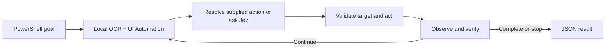

<div align="center">

# Jev Use for Windows

**Give AI agents a working pair of hands on Windows.**

Read the screen. Choose an action. Verify the result.

[](https://github.com/karajan0/jev-use-windows/actions/workflows/ci.yml)


[](LICENSE)

[Quick start](#quick-start) · [Examples](#examples) · [Commands](#commands) · [Installation guide](INSTALL.md)

</div>

---

A PowerShell-first desktop automation tool powered by [Jev](https://docs.typesafe.ai/).
It combines local OCR, Windows UI Automation, and visual matching to operate apps
and return structured JSON with completion evidence.

```powershell
.\jev.ps1 run 'Fill the form and save' --window 'Customer form' `
  --fill 'Name=Alex' --fill 'City=Seoul' `
  --click 'Save' --expect-visible 'Saved successfully'
```

## What it does

| Capability | How it helps |
| --- | --- |
| **Adaptive workflows** | Observe again after each action and follow newly opened windows and dialogs. |
| **Explicit fast paths** | Fill known fields and click exact labels without model-based action selection when they resolve uniquely. |
| **Local screen understanding** | Combine OCR, accessibility controls, and supplied reference images to locate targets. |
| **Verified input** | Check live target identity and read back supported native field values. |
| **Completion checks** | Require visible confirmation or a newly created or changed output file. |
| **Bounded execution** | Limit observation time and action count, detect repeated states, and serialize desktop input. |

## Quick start

You need **Windows 10 or 11**, **Python 3.12+**, Git, and a TypeSafe Jev or
Vercel AI Gateway key with Jev access. Run in an interactive Windows desktop.

### 1. Install

```powershell
git clone https://github.com/karajan0/jev-use-windows.git
cd jev-use-windows
Set-ExecutionPolicy -Scope Process Bypass -Force
.\Install-Windows.ps1
```

### 2. Configure your key

```powershell
.\Set-Key.ps1
.\jev.ps1 doctor
```

The key prompt is hidden. Saved keys use Windows DPAPI for the current account.
You can also supply `TYPESAFE_API_KEY` or `AI_GATEWAY_API_KEY` through environment
variables; these take precedence over saved credentials.

### 3. Pick a window and run

```powershell
.\jev.ps1 windows
.\jev.ps1 run 'Clear the calculator display to 0' --window 'Calculator'
```

Use a unique title substring with `--window`. If titles overlap, use a window
handle from `windows`, such as `--window '#123456'`.

See [INSTALL.md](INSTALL.md) for setup details and troubleshooting.

## Examples

### Fill fields and click in order

```powershell
.\jev.ps1 run 'Update the customer and save' `
  --window 'Customer form' `
  --fill 'Name=Alex' --fill 'City=Seoul' `
  --click 'Save' --expect-visible 'Saved successfully'
```

Repeat `--click` for an ordered sequence. Each button is resolved when its turn
arrives, so later buttons can appear in a new dialog. Supplied fields are handled
first. Missing buttons are re-observed for up to `--target-timeout` seconds
(default: 3); ambiguous labels stop immediately. Waiting does not consume action
steps or repeat earlier input.

### Supply exact text or a URL

```powershell
.\jev.ps1 run 'Enter the note and save it' `
  --window 'Notes' --text 'Exact note' --field 'Note'

.\jev.ps1 run 'Open the supplied page' `
  --window 'Microsoft Edge' --url 'https://example.com'
```

### Require an output file

```powershell
.\jev.ps1 run 'Save the report as Report.hwp' `
  --window 'Hancom Office' --fill 'File name=Report.hwp' `
  --expect-file "$env:USERPROFILE\Documents\Report.hwp"
```

`--expect-file` requires creation or a size/modification-time change during the
run. `--expect-visible` requires confirmation outside editable fields. When both
are supplied, both must pass.

### Locate a control from a reference image

```powershell
.\jev.ps1 run 'Click the launch control' --window 'My App' `
  --visual-target 'Launch=.\assets\launch.png' --click 'Launch' `
  --expect-visible 'Ready'
```

Supply your own tightly cropped image of the control. Matching supports several
scales and rejects ambiguous matches; it is not general recognition of unseen icons.

<details>
<summary><strong>More controls: inspect, batch, drag, and key holds</strong></summary>

Inspect detected text and targets:

```powershell
.\jev.ps1 inspect --window 'Inventory'
```

Use `batch` when every requested button is visible from the start:

```powershell
.\jev.ps1 batch 'Apply and save this record' --window 'Inventory' `
  --label 'Apply' --label 'Save'
```

Add `--dry-run` to validate batch labels without clicking.

For `run`, `--drag 'SOURCE=DESTINATION'` supplies a drag between named targets,
and `--hold 'KEYS=MILLISECONDS'` supplies a bounded key hold. Holds accept
10–2000 milliseconds. View all options with `.\jev.ps1 run --help`.

</details>

## Commands

| Command | Purpose |
| --- | --- |
| `doctor` | Check credentials, OCR languages, windows, and monitors without an API request. |
| `windows` | List visible top-level windows and handles. |
| `inspect` | Read a window's detected text and targets without an API request. |
| `run` | Execute an adaptive task or an explicit field/button workflow. |
| `batch` | Click exact labels in a stable panel and verify the final result. |

Use `--steps` to bound a run and `--observation-timeout` to limit each observation
and native UI Automation call. These calls share a reusable, isolated worker;
a timeout terminates it and stops the task without replaying uncertain input.
`--target-timeout` controls waiting for a missing explicit click target (0–60
seconds). Each observation also has its own timeout.
Run `.\jev.ps1 <command> --help` for command-specific options.

## Agent integration

Install the bundled Codex skill:

```powershell
.\Install-Skill.ps1
```

Then invoke it in a new session:

> `$jev-use-windows` Calculate 1283 × 2346 in the open Calculator window.

The skill is installed under `%USERPROFILE%\.agents\skills\jev-use-windows`.
The repository also includes the [skill source](.agents/skills/jev-use-windows/SKILL.md).

### Structured results

Commands return JSON. A shortened successful task result looks like:

```json
{
  "status": "completed",
  "goal_achieved": true,
  "goal": "Save the record",
  "window": "Inventory",
  "evidence": "Saved successfully"
}
```

Use **`goal_achieved: true`** to recognize verified task completion. Results also
include action history, model call counts, elapsed time, and stage timings.
A click or a changed screen alone does not count as success.

<details>
<summary><strong>Task status reference</strong></summary>

| Status | Meaning |
| --- | --- |
| `completed` | Completion evidence and supplied conditions passed. |
| `not_achieved` | Required completion evidence was missing. |
| `needs_input` | An exact value was needed but not supplied. |
| `blocked` | No available action could advance the task. |
| `stalled` | The same action and state repeated. |
| `uncertain` | Confidence or an action result was insufficient. |
| `step_limit` | The action limit was reached. |
| `failed` | Startup or observation failed. |

</details>

## How it works



Screenshots and reference-image matching stay local. Recognized text and action
choices are sent to the selected model provider when model selection or
verification is needed. Cached OCR and visual matching reuse unchanged content.
Explicit target searches expand a truncated accessibility traversal from 350
nodes / 5 levels to 2,000 nodes / 12 levels. If the expanded search is still
truncated, the task stops instead of assuming a label is unique.
Supported native fields use UI Automation value setting and exact readback;
other fields use the normal keyboard input path.

## Compatibility

Works with visible Windows apps, multiple monitors, negative desktop coordinates,
and connected RDP sessions. An active interactive desktop is required.

Mixed-DPI layouts are not yet verified. GPU-rendered apps and unfamiliar tiny
icons can be difficult to interpret. Visual references help with known controls;
arbitrary complex screens are not guaranteed to work. See [SECURITY.md](SECURITY.md)
for security guidance.

## Development

```powershell
python -m pip install -e . ruff pytest
python -m pytest -q
python -m ruff check .
python -m ruff format --check .
```

Regression tests run in Windows CI.

---

[MIT License](LICENSE)
